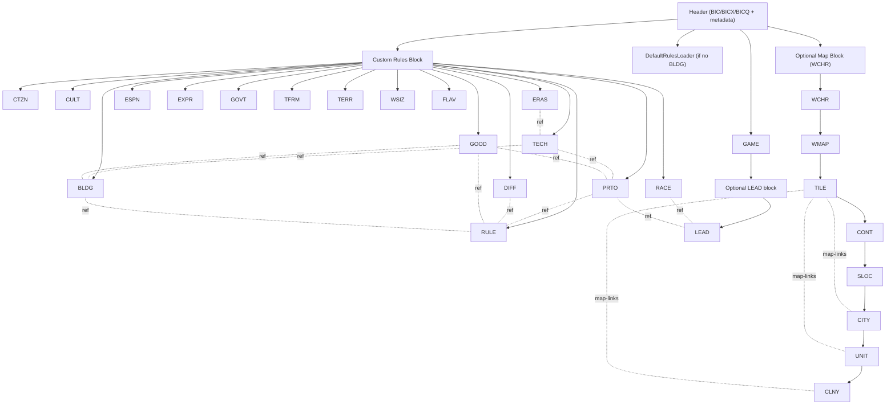

# BIQ Dependency Graph

## Purpose
A practical dependency map for BIQ sections and cross-links, derived from Quint_Editor (`IO.java`, section models, and tab wiring).

## High-Impact Link Families
- Rules and economy chain:
  - `RULE <-> PRTO/GOOD/DIFF/BLDG`
- Technology gating chain:
  - `TECH -> PRTO`, `TECH -> BLDG`, `ERAS -> TECH`
- Resource gating chain:
  - `GOOD -> PRTO`, `GOOD -> BLDG`, `GOOD -> TILE`
- Map occupancy chain:
  - `TILE <-> CITY/UNIT/CLNY`
- Player ownership chain:
  - `LEAD + owner/ownerType fields in CITY/UNIT/CLNY/SLOC`
  - effective tile-border owner path: `TILE.citiesWithInfluence -> CITY(owner/ownerType,culture) -> LEAD(optional) -> RACE(defaultColor,cultureGroup) -> LEAD.initialEra`

## Optional-Block Gates
- If custom rules section is missing, default rules are loaded instead.
- Map sections only appear with custom map (`WCHR` present).
- `LEAD` (player block) may be absent.

## Agent Guidance
- Before structural edits (add/remove/reorder), trace all downstream links in this graph and update both index fields and resolved object references.
